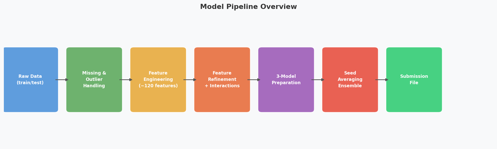
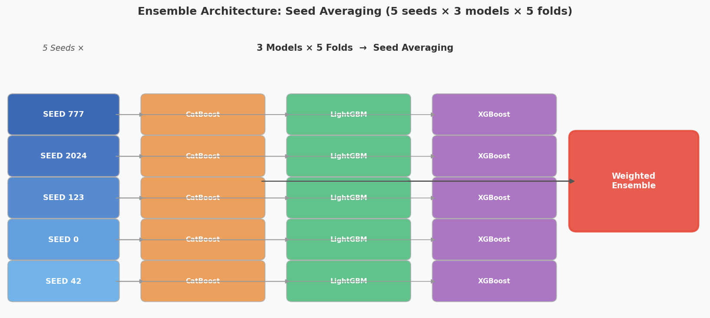
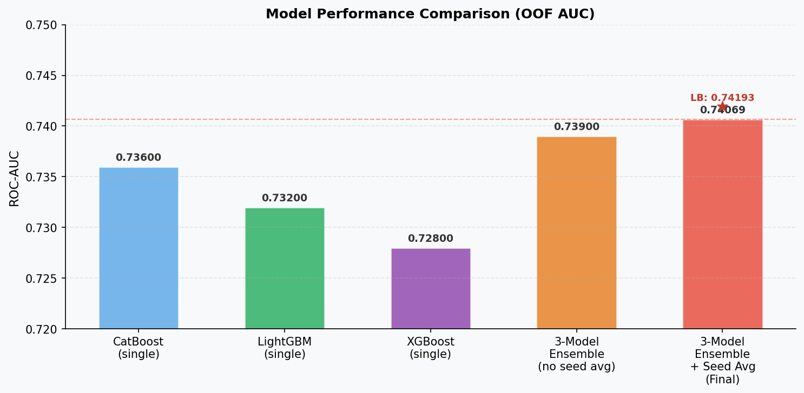

# 🧬 난임 시술 임신 성공 여부 예측 (IVF Success Prediction)

> 난임 환자의 시술 데이터를 기반으로 임신 성공 여부를 예측하는 머신러닝 모델  
> **해커톤 최종 제출 결과 — Leaderboard AUC: 0.74193**

---

## 📌 프로젝트 개요

### 🏥 배경 및 목적
전 세계적으로 증가하는 **난임 문제**는 부부들에게 신체적·정신적 부담뿐만 아니라 높은 비용적 스트레스를 야기합니다. 본 프로젝트는 인공지능(AI)을 활용하여 **최소한의 시술로 임신 성공 가능성을 높이고 환자 맞춤형 치료 계획을 수립**하는 것을 목표로 합니다.

제공된 난임 치료 데이터를 분석하여 임신 성공 여부를 예측하고, 임신을 결정짓는 최적의 특성(Feature)을 탐색함으로써 실제 의료 현장에서의 의사결정을 지원하는 혁신적인 방안을 모색합니다.

### 🎯 핵심 전략
*   **Domain-Driven FE**: 임상 도메인 지식을 적극 반영한 피처 엔지니어링을 통해 모델의 예측력과 해석력을 동시에 확보
*   **Ensemble Strategy**: CatBoost, LightGBM, XGBoost 3종 부스팅 모델의 **Seed Averaging 앙상블**을 통한 성능 최적화
*   **Imbalance Handling**: 클래스 불균형(양성 25.8%)에 강건한 **ROC-AUC**를 주요 평가 지표로 설정하여 모델의 판별 성능 극대화

### 📊 프로젝트 성과 요약
| 항목 | 내용 |
| :--- | :--- |
| **과제 유형** | 이진 분류 (Binary Classification) |
| **평가 지표** | ROC-AUC (클래스 불균형에 강건한 지표) |
| **OOF AUC** | 0.74062 |
| **Leaderboard** | **0.74195 (전체 12위)** |

---

## 👥 팀 구성

모든 팀원이 EDA부터 제출 파일 생성까지 전 과정을 독립적으로 수행한 후,
최적의 성과를 공유하는 경쟁적 협업 방식을 채택함.

| 이름 | 역할 | 주요 업무 (Common: EDA, FE, Modeling, Tuning, Ensemble) |
|---|---|---|
| 김민혁 | Git Master | GitHub Repository 관리 및 협업 워크플로우(Git-flow) 구축, 프로젝트 트러블슈팅 및 환경 세팅 가이드, 발표 자료 컨펌 |
| 신지연 | Team Leader | 프로젝트 총괄, 발표 자료(PPT) 기획 및 최종 검수, 최종 예측 파이프라인 관리, 팀 내 최고 성능 모델(SOTA) 구현 |
| 김서영 | Project Manager | Notion 워크스페이스 관리 및 데일리 회의록 작성, 발표 자료(PPT) 공동 제작 및 시각화 정돈

---

## 💾 데이터 구성 및 설명

### 📂 데이터 규모 및 특징
본 데이터셋은 실제 난임 환자의 시술 기록과 치료 과정 정보를 포함하고 있으며, 상당한 규모의 정형 데이터로 구성되어 있습니다.

*   **Data Size**
    *   **Train**: 256,351건 / 69 컬럼
    *   **Test**: 90,067건 / 68 컬럼
*   **Class Distribution (Target)**
    *   **음성(실패)**: 74.2% (190,123건)
    *   **양성(성공)**: 25.8% (66,228건)
*   **Key Statistics (시술 비율)**
    *   **IVF (체외수정)**: 97.5%
    *   **DI (인공수정)**: 2.5%

### 🔍 데이터 필드 정보
*   **독립 변수**: 환자의 연령, 난임 원인, 시술 방법(IVF/DI), 배아 발달 정보 등 임상 관련 변수
*   **종속 변수**: **임신 성공 여부 (Target)**
    *   `1`: 출산까지 성공적으로 진행된 임신
    *   `0`: 임신 실패 또는 출산까지 이어지지 않은 경우

### 주요 변수

| 변수 | 설명 |
|---|---|
| `시술 유형` | IVF(체외수정) 또는 DI(인공수정) |
| `시술 당시 나이` | 만 18–50세 범주형 (6구간) |
| `특정 시술 유형` | ICSI, FER, Blastocyst 등 세부 시술 코드 |
| `배란 유도 유형` | 과배란 유도 프로토콜 종류 |
| `수집된 신선 난자 수` | 채취한 난자 수 (난소 예비능 프록시) |
| `총 생성 배아 수` | 수정 후 생성된 배아 수 |
| `이식된 배아 수` | 자궁에 이식된 배아 수 |
| `저장된 배아 수` | 냉동 보관된 배아 수 |
| `총 시술 횟수` / `총 임신 횟수` | 누적 시술·임신 이력 |
| `불임 원인 - *` | 난관 질환, 남성 요인, 배란 장애 등 10개 이진 변수 |
| `착상 전 유전 검사/진단 사용 여부` | PGS/PGD 여부 |
| `임신 성공 여부` | **타겟 변수** (0: 실패, 1: 성공) |

> 전체 피처 수: 학습 전 약 200개 이상 (원본 + 파생 합산)

---

## 🔧 데이터 전처리

### 핵심 전처리 전략

**1. 구조적 결측치(Structural Missingness) 처리**

DI 시술은 배아 생성·이식 과정 자체가 없으므로, 관련 컬럼의 결측은 단순 누락이 아닌 시술 구조 차이에서 비롯됩니다.  
일반적인 평균/중앙값 대체를 적용하면 모델이 시술 유형 차이를 왜곡하여 학습하므로, 아래 순서를 엄격히 지킵니다.

```
플래그 생성 (notna → 진입 여부) → DI 배아 수 컬럼 0 대체 → DI 경과일 -1 특이값 대체
```

**2. 처리 단계 요약**

| 단계 | 대상 | 처리 방법 |
|---|---|---|
| STEP 1 | 난자 채취·배아 이식 등 경과일 | `notna()`로 진입 여부 플래그 생성 |
| STEP 2 | DI 환자의 배아 관련 수치 | 0으로 대체 (구조적 결측) |
| STEP 3 | DI 환자의 경과일 컬럼 | -1 특이값 대체 |
| STEP 4 | 범주형 변수 결측 | `'missing'` 문자열로 대체 |
| STEP 5 | 고결측 변수 | 결측 여부 이진 플래그 추가 생성 |
| STEP 6 | 음수 수치 | NaN 처리 + 도메인 상한 클리핑 |

**3. 이상치 처리 — 도메인 상한 클리핑**

| 변수 | 상한 |
|---|---|
| 수집된 신선 난자 수 | 50개 |
| 혼합된 난자 수 | 50개 |
| 총 생성 배아 수 | 40개 |
| 이식된 배아 수 | 5개 |
| 저장된 배아 수 | 30개 |

---

## 🛠️ 피처 엔지니어링

난임 임상 도메인 지식 기반으로 약 **120개 파생 피처**를 생성했습니다.

### 피처 카테고리

| 카테고리 | 주요 피처 예시 |
|---|---|
| **나이** | `나이_순서`, `나이_35이상`, `나이_40이상`, `나이_성공률_사전점수` |
| **난소 예비능** | `poor_responder`, `high_responder`, `난소반응_그룹`, `난자수_log` |
| **배아 품질** | `수정_효율`, `ICSI_수정_효율`, `이식_효율`, `배아품질_종합점수` |
| **시술 유형 파싱** | `배반포이식_여부`, `ICSI_여부`, `FER_여부`, `AH_여부`, `기술집약도_점수` |
| **경과일 간격** | `배양_기간_일`, `채취_이식_총기간`, `배양기간_D5추정`, `이식_단계_범주` |
| **시술 이력** | `총_실패_횟수`, `RIF_플래그`, `첫시도_여부`, `과거_임신성공률` |
| **불임 원인** | `불임원인_수`, `정자_문제_수`, `복합원인_플래그`, `불임원인_주체` |
| **PGT** | `PGT_사용_여부`, `고령_PGT_조합`, `RIF_PGT_조합` |
| **난자/정자 출처** | `기증난자_사용`, `자가난자_고령_조합`, `젊은기증난자_조합` |
| **교호작용** | `나이_배아품질_상호작용`, `이식배아수_나이_교호`, `난임_난이도_점수` 등 20+개 |

> ⚠️ 나이 사전점수는 train 통계로만 계산하여 Data Leakage를 방지했습니다.

---

## 🤖 모델링



### 모델 준비 전략

모델별 범주형 변수 처리가 다르기 때문에 3가지 전처리 경로를 별도로 구성했습니다.

| 모델 | 범주형 처리 | 수치형 결측 |
|---|---|---|
| **CatBoost** | 원본 문자열 + 인덱스 전달 | 내부 처리 |
| **LightGBM** | `category` dtype 변환 | 내부 처리 |
| **XGBoost** | `OrdinalEncoder` 인코딩 | train 중앙값으로 대체 |

### 앙상블 전략 — Seed Averaging



```
동일 하이퍼파라미터 × 5개 SEED (42, 0, 123, 2024, 777) × 5-Fold CV
→ 75개 모델(3×5×5)의 예측 평균 → 최적 가중치 앙상블
```

- **Seed Averaging 목적**: 파라미터 변경 없이 랜덤성에 의한 분산만 줄임 (과적합 리스크 최소화)
- **가중치 탐색**: OOF 예측 기반 grid search (`0.05` 간격)

---

## 📈 실험 결과

| 모델 | OOF AUC | 비고 |
|---|---|---|
| CatBoost (단일) | ~0.736 | Optuna 50 trials |
| LightGBM (단일) | ~0.732 | Optuna 50 trials |
| XGBoost (단일) | ~0.728 | Optuna 50 trials |
| 3모델 앙상블 (Seed Avg 없음) | ~0.739 | 최적 가중치 탐색 |
| **3모델 앙상블 + Seed Averaging** | **0.74069** | 최종 제출 |



**Leaderboard 최종 점수: 0.74193**

---

## 🏆 최종 모델

**CatBoost + LightGBM + XGBoost Weighted Ensemble (Seed Averaging 5 Seeds)**

### 선택 이유

- 각 모델이 범주형 변수를 다루는 방식이 달라 상호 보완적인 예측 다양성 확보
- Seed Averaging으로 단일 SEED 대비 OOF 분산 감소, 안정적인 성능 향상
- OOF 기반 가중치 최적화(grid search)로 Data Leakage 없이 앙상블 가중치 결정
- 리더보드와 OOF 점수 간 갭이 작아 일반화 성능이 검증됨 (OOF: 0.74069 / LB: 0.74193)

### 최종 하이퍼파라미터 (Optuna 50 trials)

**CatBoost**
```
iterations=794, learning_rate=0.0301, depth=7
l2_leaf_reg=7.43, bagging_temperature=0.398
early_stopping_rounds=50
```

**LightGBM**
```
num_leaves=22, max_depth=7, learning_rate=0.0203
n_estimators=956, subsample=0.992, colsample_bytree=0.876
min_child_samples=98
```

**XGBoost**
```
max_depth=4, learning_rate=0.0288, n_estimators=835
subsample=0.876, colsample_bytree=0.896
min_child_weight=8, gamma=0.729
```

---

## 🚀 실행 방법

### 환경 설치

```bash
pip install pandas numpy scikit-learn xgboost lightgbm catboost optuna
```

### 데이터 경로 설정

`final.ipynb` 내 `DATA_DIR` 변수를 로컬 데이터 경로로 수정합니다.

```python
DATA_DIR = '/your/local/path/to/data/raw'
```

### 모델 학습 및 예측 생성

Jupyter Notebook에서 셀을 순서대로 실행합니다.

```
Section 0 → 1 → 2 → 3 → 4 → 5 → 6
```

출력 파일: `submission_final_fixed.csv`

---

## 📂 프로젝트 구조

```
fertility-treatment-prediction
├── .venv/                   # 가상환경 설정 폴더
├── data/raw/                # 원본 데이터 (데이터 명세, train/test/submission 샘플)
├── eda/                     # 초기 데이터 탐색 및 시각화 분석 결과
│   ├── eda_jiyeon.ipynb
│   └── eda_minhyuk.ipynb
├── modeling/                # 모델링 관련 주요 파일
│   └── final.ipynb          # 프로젝트 최종 모델 및 예측 코드
├── notebooks/               # 팀원별 개별 실험 및 작업 공간
│   ├── jiyeon/              # 신지연 작업 폴더
│   └── minhyuk/             # 김민혁 작업 폴더
├── src/legacy/              # 이전 버전의 전처리 및 실험용 스크립트
│   └── preprocessing_exp.py
├── submissions/             # 최종 예측 결과물 (CSV 파일) 저장 폴더
│   └── submission_v1.csv
├── .gitignore               # Git 추적 제외 설정 (catboost_info, 데이터 등)
├── baseline.py              # 모델 학습 및 성능 평가 베이스라인 코드
├── final_fixed_보고서.docx    # 최종 프로젝트 결과 보고서
├── final_fixed_브리핑.docx    # 최종 브리핑 및 발표 자료
├── quick_check.py           # 데이터 및 모델 간단 검증 스크립트
├── README.md                # 프로젝트 개요 및 안내서
└── requirements.txt         # 프로젝트 라이브러리 의존성 목록
```

---

## 🛠️ 사용 기술

| 분류 | 라이브러리 |
|---|---|
| **데이터 처리** | `pandas`, `numpy` |
| **모델** | `xgboost`, `lightgbm`, `catboost` |
| **검증** | `scikit-learn` (StratifiedKFold, ROC-AUC) |
| **튜닝** | `optuna` |
| **전처리** | `OrdinalEncoder`, `pd.cut`, log transform |

---

## 🐛 트러블슈팅

### 🏗️ ML Ops & Data Engineering (김민혁)

**1. 실험 재현성을 위한 의존성 및 Python 환경 격리 (26.04.24)**
*   **문제**: 가상환경 내 라이브러리 인식 실패로 인한 분석 환경 불일치 발생.
*   **원인**: 인터프리터 경로 설정 오류로 인해 설치 환경과 실행 환경이 분리됨.
*   **해결**: 환경 기준을 강제하는 `python -m pip` 설치 전략 및 가상환경 경로 명시를 통해 **분석 환경의 일관성** 확보.

**2. 고도화된 파생 변수 생성을 위한 데이터 타입 안정화 (26.04.25)**
*   **문제**: 의료 데이터 특수 문자로 인한 연산 충돌 및 `TypeError` 발생.
*   **원인**: 수치형 컬럼 내 문자열 혼입으로 인한 파이썬 산술 연산 제한.
*   **해결**: `pd.to_numeric` 기반의 방어적 타입 변환 파이프라인 구축을 통해 **결측치 0개의 정제된 피처셋(74개)** 도출.

**3. 모델 입력 데이터의 무결성 및 타입 인터페이스 최적화 (26.04.29)**
*   **문제**: CatBoost 앙상블 학습 중 데이터 타입 변이로 인한 `CatBoostError` 발생.
*   **원인**: K-Fold 분할 및 전처리 루프 중 특정 컬럼의 형변환(`int` -> `float`) 발생.
*   **해결**: 모델 입력 직전 `cat_features`의 타입을 문자열로 강제화하여 **앙상블 파이프라인의 견고함(Robustness)** 증대.

**4. 데이터 정합성 보장을 위한 Groupby 연산 로직 개선**
*   **문제**: Target Encoding 과정에서 Numpy Array 참조 오류(`KeyError`) 발생.
*   **원인**: Pandas 연산 내에서 명시적 컬럼명이 아닌 메모리 주소(Numpy)를 참조하여 인덱싱 실패.
*   **해결**: 명시적 키 매핑 방식을 도입하여 **대용량 범주형 변수의 타겟 인코딩 수치 정합성** 확보.

**5. 예외 처리를 통한 실험 중단 방지 및 Feature Selection 복구**
*   **문제**: GPU 연산 경고로 인한 셀 종료 및 중요도 변수 미정의 에러 발생.
*   **원인**: 외부 라이브러리 경고에 따른 코드 실행 흐름 단절.
*   **해결**: 메모리 적재 데이터를 활용한 수동 복구 로직 적용으로 **모델링 실험의 연속성** 유지.

---

### 🧪 Model Architecture & Collaborative Workflow (신지연)

**1. 원격-로컬 브랜치 이력 불일치에 따른 Divergent Branches 대응**
*   **문제**: `git pull` 시 로컬과 원격의 커밋 히스토리가 서로 달라 `fatal: Need to specify how to reconcile divergent branches` 에러와 함께 통합 프로세스 중단.
*   **원인**: 팀원 간의 활발한 작업으로 인해 원격 `main`과 로컬 브랜치 양쪽에 각각 독립적인 커밋이 생성되어 자동 병합이 불가능한 상태 발생.
*   **해결**: 팀 내 협업 규칙에 따라 `git config pull.rebase false` 설정을 적용하여 로컬 작업 내역과 원격 변경 사항을 안전하게 병합(Merge)함.
*   **결과**: 팀원 간의 소스 코드 동기화 및 최신 메인 브랜치 이력 확보를 통해 협업의 연속성 유지.

**2. XGBoost 라이브러리 업데이트에 따른 API 규격 호환성 이슈 (TypeError)**
*   **문제**: 최신 버전의 XGBoost를 활용한 모델 학습(fit) 중 `early_stopping_rounds` 인수를 인식하지 못하고 `TypeError` 발생.
*   **원인**: 라이브러리 버전 업데이트 과정에서 `early_stopping_rounds` 파라미터가 `fit()` 메서드의 인자에서 `XGBClassifier` 생성자의 인자로 변경됨.
*   **해결**: 구버전 방식인 `fit()` 내 전달 방식을 삭제하고, 모델 객체 생성 시점에 조기 종료 조건을 미리 정의하도록 코드를 수정하여 최신 API 규격 반영.
*   **결과**: 오류 없이 앙상블 학습 파이프라인이 정상 작동하였으며, 과적합 방지를 위한 조기 종료 기능 정상 수행 확인.

---

## 🔭 향후 개선 방향

- **Stacking 앙상블**: 현재 weighted blending에서 meta-learner 기반 stacking으로 확장
- **추가 도메인 피처**: 배아 등급 정보, 클리닉별 성공률 등 외부 데이터 결합
- **Neural Network 계열 추가**: TabNet, FT-Transformer 등 tabular 특화 딥러닝 모델 실험
- **Feature Selection 고도화**: SHAP 기반 중요도로 노이즈 피처 제거 자동화
- **Optuna trials 증가**: 현재 50 trials → 200+ trials로 탐색 범위 확대